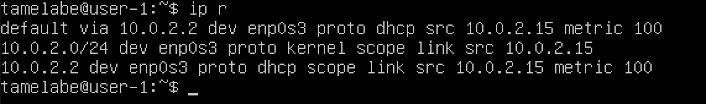
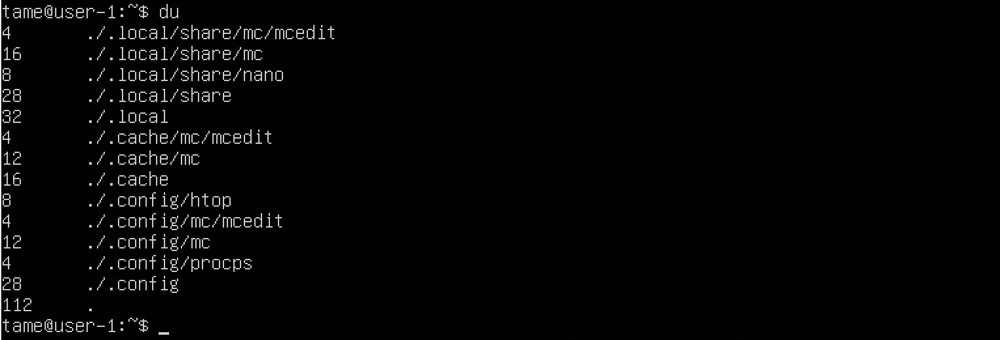

## Part 1. Установка ОС
* Установка Ubuntu 20.04 Server LTS без графического интерфейса 
* Проверяем версию Ubuntu командой `cat /etc/issue` 
 *Версия Ubuntu* 

## Part 2. Создание пользователя
* Создаём нового пользователя командой `sudo adduser tame` 
 *Создание нового пользователя tame*
 

* Вызываем команду `sudo usermod -aG adm tame` 
 *tame даны права администратора*
 

* Вызываем команду `cat /etc/passwd`  
 *Проверка создания пользователя* 

## Part 3. Настройка сети ОС
* Изменяем название машины на user-1 с помощью команды `hostnamectl set-hostname user-1` 
 *Изменяем название машины*
 
* Выполняем перезагрузку для сохранения изменений
* Вызов `cat /etc/hostname`  
 *Проверяем изменение названия машины*
 

* Проверяем текущие настройки часового пояса командой `timedatectl` 
 *Проверка часового пояса*
 

* Устанавливаем нужный часовой пояс командой  `sudo timedatectl set-timezone Europe/Moscow` 
 *Установка часового пояса*
 

* Проверяем изменения командой `timedatectl` 
 *Проверка изменений*
 

* Вывод названия сетевых интерфейсов с помощью команды `ls /sys/class/net` 
 *Названия сетевых интерфейсов*
 

* **Loopback** — совокупность методов, нужных для корректной работы маршрутизатора и передачи данных. 
* Сам интерфейс же является отображением логических процессов в маршрутизаторе. Также саму технологию используют и для других целей: 
    1) тестирование передачи данных от обслуживающего центра коммутации; 
    2) проверка сигнала на расстоянии; 
    3) обеспечение работы коммутационных кабелей и их проверка; 
    4) тест обратной петли, когда сигнал посылается и возвращается отправителю по всем коммуникационным каналам. 

* С помощью команды `ip r` получаем ip адрес устройства, на котором мы работаем, от DHCP сервера. 
 *ip-адрес устройства*
 

* **Dynamic Host Configuration Protocol (DHCP)** - это протокол управления сетью, используемый в сетях TCP/IP, в котором DHCP-сервер динамически присваивает каждому устройству IP-адрес и другие параметры сетевой конфигурации, чтобы они могли связываться с другими IP-сетями. 

* Выводим внешний(ip) и внутренний(gw) ip-адреса шлюза командами `wget -qO- eth0.me` и `ip route | grep default` 
 *ip-адреса шлюза* 
 

* Задаем статичные настройки ip, gw, dns командой `sudo nano /etc/resolv.conf` 
 *Редактирование настроек ip, gw и dns*
 

* Перезагружаем виртуальную машину командой `reboot` 
* Проверяем, что статичные сетевые настройки (ip, gw, dns) соответствуют данным, командой  `ping -c 8 8.8.8.8 && ping -c 8 ya.ru` 
 *Проверяем настройки*
 

## Part 4. Обновление ОС
* Командой `sudo apt update` узнаём, сколько есть пакетов обновления 
* Обновляем системные пакеты до последней, на момент выполнения задания, версии командой `sudo apt full-upgrade` 
* После обновления системных пакетов, вводим команду обновления повторно, выводится сообщение, что обновления отсутствуют. 
 *Проверяем обновления* 

## Part 5. Использование команды sudo
* sudo (англ. Substitute User and do, дословно «подменить пользователя и выполнить») — программа для системного администрирования UNIX-систем, позволяющая делегировать те или иные привилегированные ресурсы пользователям с ведением протокола работы. 
Разрешаем пользователю(tame), созданному в Part 2, выполнять команду sudo командой `sudo usermod -a -G sudo tame` 
 *Разрешение sudo*
 

* Переключение на пользователя `su - tame` 
* Изменение и проверка hostname ОС от имени пользователя *tame* `sudo hostname tame` 
 *hostname ОС от имени пользователя tame* 

## Part 6. Установка и настройка службы времени
Настраиваем службу автоматической синхронизации времени 
* Командой `date` вывести время, часового пояса, в котором мы сейчас находимся 
 *Вывод времени*
 

* Установка NTP командой `sudo apt install systemd-timesyncd` 
* Активируем NTP командой `sudo timedatectl set-ntp on` 
* Вывод команды `timedatectl show` содержит **NTPSynchronized=yes**:  
 *Вывод команды* 

## Part 7. Установка и использование текстовых редакторов
Установка текстового редактор MCEDIT командой `sudo apt install mc` 

Создаём и редактируем файл с сохранением изменений: 
* **VIM**: создаем файл с помощью команды `vim test_vim.txt` 
* Нажимаем на "i" в самом редакторе, для редактирования 
* Пишу свой ник: "tamelabe" 
Для выхода с сохранением используем команды: `Esc`, `:wq`, `Enter` 

 

* **NANO**: создаем файл с помощью команды `nano test_nano.txt` 
* Пишу свой ник: "tamelabe" 
* Для выхода с сохранением используем команды: `ctrl+x`, `Y`, `Enter` 

 

* **MCEDIT**: создаем файл с помощью команды `mcedit test_mcedit.txt` 
* Пишу свой ник: "tamelabe" 
* Для выхода с сохранением используем команды: `fn+F2`, `Enter`, `fn+F10` 

 

Редактирование файла с заменой слова без сохранения изменений: 
* **VIM**: открываем файл с помощью команды `vim test_vim.txt` 
* Нажимаем на "i" в самом редакторе, для редактирования 
* Изменяем "tamelabe" на "21 School 21" 
* Для выхода без сохранения используем команды: `Esc`, **`:q!`**, `Enter` 

 

* **NANO**: открываем файл с помощью команды `nano test_nano.txt` 
* Изменяем "tamelabe" на "21 School 21" 
* Для выхода без сохранения используем команды: `ctrl+x`, `N`, `Enter` 

 

* **MCEDIT**: открываем файл с помощью команды `mcedit test_mcedit.txt`. 
* Изменяем "tamelabe" на "21 School 21" 
* Для выхода без сохранения используем команды: `fn+F10`, `No`, `Enter` 

 

Редактирование файла с поиском и заменой слова: 
* **VIM**: открываем файл с помощью команды `vim test_vim.txt` 
* Для поиска в VIM вводим `/tamelabe` и искомое слово выделяется в самом редакторе 

 :

* Для замены слова в VIM вводим `:%s/tamelabe/21 School 21` и слово "tamelabe" заменяется на "21 School 21" 

 

* **NANO**: открываем файл с помощью команды `nano test_nano.txt` 
* Для поиска в NANO вводим `ctrl+W` 

 

* Для замены слова в NANO вводим `ctrl+\`, пишем "tamelabe", нажимаем `Enter`, пишем "21 School 21", нажимаем `Enter`, выбираем `Y` 

 

* **MCEDIT**: открываем файл с помощью команды `mcedit test_mcedit.txt` 
* Для поиска в MCEDIT вводим `fn+F7`, вводим слово, которое хотим найти, нажимаем `Enter` 

 

* Для замены слова в MCEDIT вводим `fn+F4` пишем "tamelabe", нажимаем на клавишу "стрелка вниз", пишем "21 School 21", нажимаем `Enter`, выбираем `Replace` 
 
 

## Part 8. Установка и базовая настройка сервиса SSHD
* Устанавливаем службу SSHd командой `sudo apt install openssh-server` 
* Проверяем наличие командой `ssh -V` 
 *Служба SSHd*
 

* Добавляем автостарт службы SSHd командой `sudo update-rc.d ssh defaults` 
* Изменяем порт SSHd командой `sudo vim /etc/ssh/sshd_config` 
* Добавляем строку `Port 2022`. 
 *Прописываем порт 2022*
 

* Для применения изменений используем команду `/etc/init.d/ssh restart` 
 *Перезапуск*
 

Проверяем наличие процесса SSHd командой `ps -axfv | grep sshd` 
 *Наличие процесса SSHd*
 

* Команда `ps` выводит список текущих процессов на вашем сервере. Используется обычно в сочетании с командой `grep` 
* Флаги: 
    1) -a: Выбирает все процессы, кроме лидеров сеансов и процессов, не связанных с терминалом. 
    2) -x: Заставляет `ps` отображать список всех процессов, которыми вы владеете (тот же EUID, что и у `ps`), или перечислять все процессы при использовании вместе с опцией a 
    3) -f: Выводит полноформатный список 
    4) -v: Выводит информацию о версии 

* Устанавливаем **net-tools** `sudo apt install net-tools` 
* Выполняем команду `netstat -tan` 
 *Выполнение команды netstat -tan*
 

* Опция **-a** показывает состояние всех сокетов; **-n** показывает ip адрес, а не сетевое имя; **-t** показывает только tcp соединения. 
* Значения столбцов: 
    1) Proto - протокол, используемый сокетом; 
    2) Recv-Q - количество байтов, не скопированных пользовательской программой, подключенной к этому сокету; 
    3) Local Address - локальный адрес (имя локального хоста) и номер порта сокета; 
    4) Foreign Address - удаленный адрес (имя удаленного хоста) и номер порта сокета; 
    5) State - состояние сокета; 
    6) 0.0.0.0 в этом контексте означает "все IP-адреса на локальной машине". 
* Перезагружаем систему командой `sudo reboot` 

## Part 9. Установка и использование утилит **top**, **htop**
**top**: 
* Запуск утилиты **top** командой `top` 

 

* uptime: 
* количество авторизированных пользователей 
* общая загрузка системы 
* общее количество процессов 
* загрузка cpu 
* загрузка памяти 

 

* pid процесса, занимающего больше всего памяти 
* pid процесса, занимающего больше всего процессорного времени 

 

**htop**: 
* Запуск утилиты **htop** командой `htop`  

 

* Для выбора поля сортировки использовать `F6`:
    * PID 
    
     

    * PERCENT_CPU 
    
     
    
    * PERCENT_MEM 
    
     
    
    * TIME 
    
     
    
    * Для фильтра по SSHd используются клавиши `fn+F4`, `"sshd"`, `Enter` 
    
     
    
    * Для поиска процессa syslog используются клавиши `fn+F3`, `"syslog"`, `Enter` 
     
    * Дополнительные поля, такие какие как `"uptime"`, `"clock"`, `"hostname"` добавляем через опцию `"Setup" fn+F2.` 
     

## Part 10. Использование утилиты **fdisk**
* Запуск утилиты командой `sudo fdisk -l`, проверка размера swap `swapon --show` 
    
     

    * Название жесткого диска: VBOX HARDDISK 
    * Размер: 10 GiB 
    * Количество секторов: 20971520 
    * Размер swap: 1.7G  

## Part 11. Использование утилиты **df**
* Выводим команду `df /` 
    
     
    
    * Размер раздела: 9299276 
    * Размер занятого пространства: 4842648 
    * Размер свободного пространства: 3962652 
    * Процент использования: 55% 
    * Единица измерения в выводе: Кб 

* Вывод команды `df -Th /` 
    
     

    * Размер раздела: 8.9G 
    * Размер занятого пространства: 4.7G 
    * Размер свободного пространства: 3.8G 
    * Процент использования: 55% 
    * Тип файловой системы для раздела: ext4 

## Part 12. Использование утилиты **du**
* Запуcк команды `du` 
    
     

* Вывести размер папок `/home`, `/var`, `/var/log` с помощью команды `sudo du -s -h /home && sudo du -s -h /var && sudo du -s -h /var/log` 
    
     
    
* Вывести размер всего содержимого в `/var/log` с помощью команды `sudo du -a -h /var/log` 
     

## Part 13. Установка и использование утилиты **ncdu**
* Устанавливаем утилиту **ncdu** командой `sudo apt install ncdu` 
* Вывести размер папок с помощью команды `ncdu`: 
* `/home`  
* `/var`  
* `/var/log`  

## Part 14. Работа с системными журналами
* Время последней успешной авторизации, имя пользователя и метод входа в систему 
    
     
    
     

    * Время авторизации: Jul 19 19:28 
    * Имя пользователя: tamelabe 
    * Метод входа в систему: tty1 
    * Перезапустить службу SSHd: `sudo /etc/init.d/ssh restart` 
    * Сообщение о рестарте службы: `sudo cat /var/log/syslog` 
     

## Part 15. Использование планировщика заданий **CRON**
* Установка **CRON**: `sudo apt install cron` 
* Запланировать задачу: `crontab -e` 
* Запланировать команду uptime каждые 2 минуты: `"*/2 * * * * uptime"`, `ctrl+x`, `y`, `Enter` 

 

* Список текущих заданий для **CRON** выводится командой `crontab -l` 

 

* Строчки о выполнении в системных журналах выводим с помощью команды `sudo grep CRON /var/log/syslog` 

 

* Удалить все задания из планировщика: `crontab -r` 
* Список текущих заданий для **CRON** выводится командой `crontab -l` 
 
